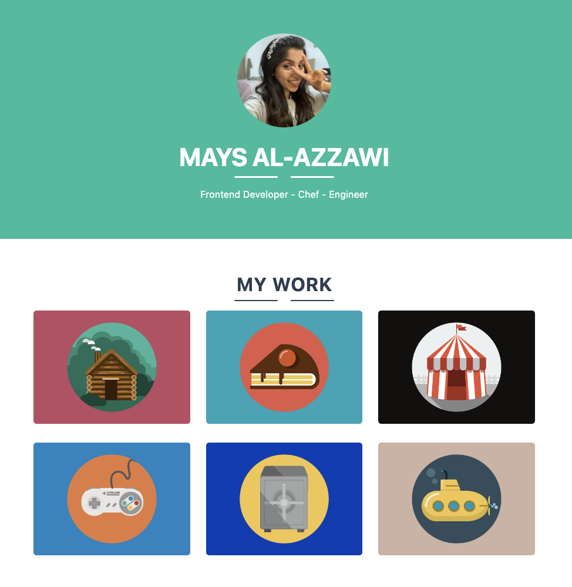
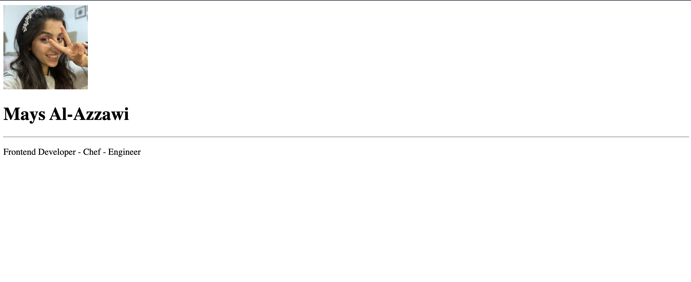
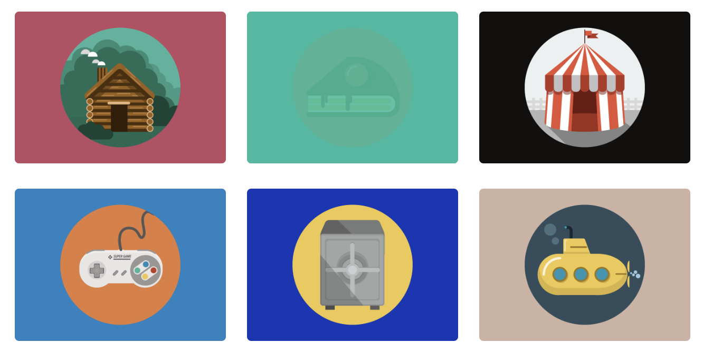
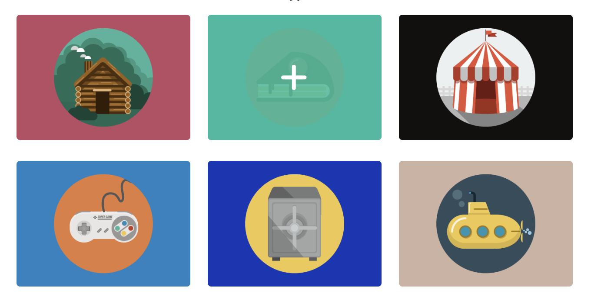

# Instructions  

Write the HTML and CSS code to create a webpage similar to this:

## Steps
1. Before starting to write your code, think how you will divide the 
   content of the page and how many divs you will need.
   For example, this is how I would divide it:
   

2. Go to `index.html` to start writing the HTML code for this website.

3. Inside the `body` tag put your parent divs (the div1 and div2 shown in the image above).

4. Inside div1 start putting some content as follows:
   -  image tag (put your image and show us your lovely face 😎)
   -  heading tag
   -  hr tag 
   -  p tag
     
   Check out these resources if you need to know more about these tags:
     - [HTML Images](https://www.w3schools.com/html/html_images.asp)
     - [Adding Image in Replit](https://replit.com/talk/ask/can-someone-help-i-dont-know-how-to-add-an-image-in-html/112884)
     - [HTML h1 to h6 Tags](https://www.w3schools.com/tags/tag_hn.asp)
     - [HTML hr Tag](https://www.w3schools.com/tags/tag_hr.asp)
     - [HTML p Tag](https://www.w3schools.com/tags/tag_p.asp)
  
   If you don't know the syntax or how to use these tags, don't worry you don't have to memorize everything. Don't forget that we can ask our friend 3amo Google whenever we are stuck.
  

5. Your page might look like this after you've added the above elements:
  
  
6. So now it's time to add some styles and make the page prettier! To start styling using Bootstrap go to 3amo Google and search for:
    "how to set up bootstrap?"
   
   Or check out this link it may help you:
     [Getting started with bootstrap](https://getbootstrap.com/docs/5.1/getting-started/introduction/)
     
     Test your bootsrap to see if it is working, you can test it by putting "bg-primary" class to Div1.
   If you are having a proplem with setting up bootstrap, this page may help you:
     [Bootstrap CSS not loading](https://stackoverflow.com/questions/21415725/bootstrap-css-not-loading/46782085#46782085)
   
 
7. After setting up Bootstrap, let's start styling our div1. First, let's put its content in the middle of the page.

   To do this you can check out this link:
   [Text alignment](https://getbootstrap.com/docs/5.0/utilities/text/#text-alignment)
  

8. To change the background of div1 you can choose any color you want, Check out this link:
   [Background color](https://getbootstrap.com/docs/5.0/utilities/background/#background-color).
   
   
9. Now let's make our profile image rounded as a circle. Check out this [link for how to make the image rounded?](https://mdbootstrap.com/how-to/bootstrap/circle-image/).
   

10. To change the font size or type check out this link: [how do I change the font size and font type with bootstrap?](https://getbootstrap.com/docs/5.0/content/typography/).
   
  
11. Now let's make the dividers under the image. To do this you can use this link [How to make horizontal dividers?](https://mdbootstrap.com/docs/standard/content-styles/dividers/).
   
12. For div2 as we can see we can divide it into two divs: one at the top for the text, let's call it `TextDiv`.
     And another one for the the images contanier. Let's call it `ImageContainerDiv` as shown below:
   

13. We have already explained above something similar to `TextDiv`, so I will leave it to you to do it 😉.
  

14. For `ImageContainerDiv` you can check out this link it may help you:
    [Grid-Rows-Columns in bootstraps](https://getbootstrap.com/docs/5.0/layout/grid/#sass])

## Bonus

If you made it this far and you're looking for a greater challenge, consider make the following changes:

- Instead of the provided images that have a built in background color, use an [image like this one](https://icons.iconarchive.com/icons/flat-icons.com/flat/512/Cake-icon.png), and wrap it in a div to provide the background color of the surrounding box using HTML and CSS.
  
- Add hover state to the images so they get highlighted when the mouse hovers over them, as shown below:
  

- Add a `+` icon to the hover state:
  

## Additional Bonus 
If you found all of this too easy and want an even greater challenge, feel free to start expanding and introduce more features to your portfolio. Consider this to be your own website, what would you like to add to it?

If you have existing works you'd like to show case, add it here. If there are more interesting photos or icons you prefer to use, go ahead!

Show us your style and express yourself through this if you're feeling excited to expand this page.